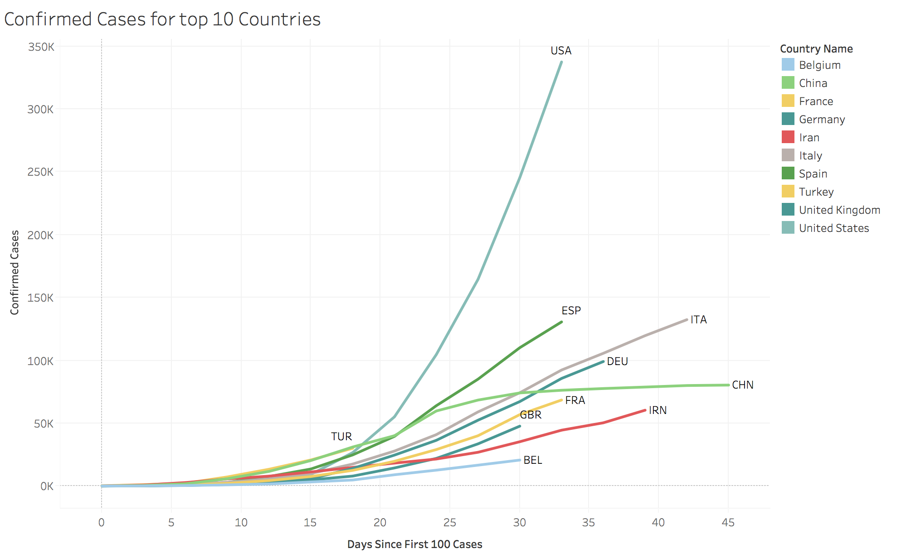
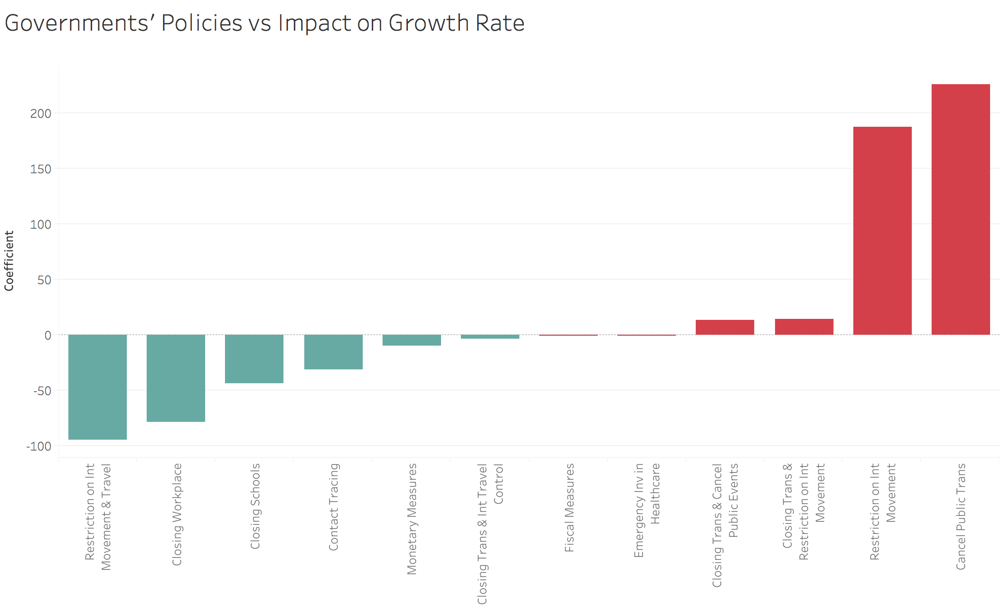

```{r setup, include=FALSE}
knitr::opts_chunk$set(echo = TRUE)
```

## Data Source & Summary

OXFORD COVID-19 GOVERNMENT RESPONSE TRACKER: aims to track and compare government responses to the coronavirus outbreak worldwide rigorously and consistently. We can analyze how specific government measures affect outcomes in terms of COVID cases and deaths.
https://www.bsg.ox.ac.uk/research/research-projects/oxford-covid-19-government-response-tracker

#### 13 Measures Tracked by Oxford:

* S1_School closing
* S2_Workplace closing
* S3_Cancel public events
* S4_Close public transport
* S5_Public information campaigns
* S6_Restrictions on internal movement
* S7_International travel controls
* S8_Fiscal measures
* S9_Monetary measures
* S10_Emergency investment in health care
* S11_Investment in Vaccines
* S12_Testing framework
* S13_Contact tracing

OxCGRT collects publicly available information on 13 indicators of government response (S1-S13). Nine of the indicators (S1-S7, S12 and S13) take policies such as school closures, travel bans, etc. are recorded on an ordinal scale; the remainder (S8-S11) are financial indicators such as fiscal or monetary measures.

This endpoint provides JSON by with country stringency data, confirmed cases and deaths on a day by day basis as collected by our data collection team. The stringency_actual field is the daily calculated data. The stringency field is a convenience field for visualisations which holds previous day data (up to 7 days) if data in unavailable for a given day.

#### Other data in dataset:

* ConfirmedCases
* ConfirmedDeaths
* StringencyIndex

Oxford has a StringencyIndex that measures how stringent each government has reacted. I thought, maybe we can introduce Proactivity index - how many measures country has introduced before first ConfirmedCase and first ConfirmedDeath. I assume this affects the outcomes as well. Then one of our questiond would be: What has been more effective stringency or proactivity?

Interesting analysis of Oxford data:
https://www.bsg.ox.ac.uk/research/research-projects/oxford-covid-19-government-response-tracker?ref=researchstash

White Paper on Data:
https://www.bsg.ox.ac.uk/sites/default/files/2020-04/BSG-WP-2020-031-v4.0_0.pdf


## Data Exploration
### Read File
Read file in. Noticed it has a lot of "Notes" columns used to supply source of change in variable. The "General" columns indicate whether measure is geographically targeted or general.

```{r ,}
# read the csv into a dataframe
data = read.csv("OxCGRT_Download_190420_130939_Full.csv")

# see columns in data
names(data)
```


#### Get Top Countries
Top number of countries is based on the number of Confirmed Cases on 04-08-2020. This can be modified if data is updated.
```{r ,}
# number countries interested in
num_c = 30
# date evaluated
e_date = 20200419

# look at the rows with the evaluation date
data_eval = subset(data, data$Date == e_date)
# order data in descending order based on num cases and deaths
data_eval = data_eval[order(-data_eval$ConfirmedCases, -data_eval$ConfirmedDeaths),]
# take the levels of first num_c rows of the CountryName column
top = levels(factor(head(data_eval,num_c)$CountryName))

top
```

#### Filter data to only include Top Countries
```{r ,}
# take the subset of data related to top countries
df_top = subset(data, CountryName %in% top)
df_top = subset(df_top, df_top$Date <= e_date)

# drop unused levels from all factors
df_top[] = lapply(df_top, function(x) if(is.factor(x)) factor(x) else x)
df = df_top
```

#### Dealing with General vs Targetted
Data includes targeted and general measures. When the general column is 1 it means the measure was general (for the whole country), when the general column is 0 it means the measure was targetted to a specific geographical locaiton. We are only interested in looking at data generally applied to the whole country.
```{r ,}
# find columns with General in name
General = c(grep( "General" , names( df) ))

# multiple isGeneral column to measure column and only look at general data
for (column in General){
  df[,column-1] = df[,column] * df[,column-1]
}
```

#### Separate or remove excess columns
The Notes and General columns do not pertain to our prediction model. We will also only be using the Display Stringency Index as it is more complete.
```{r ,}
# find columns with Notes in name
Notes = c(grep( "Notes" , names( df) ))
# save notes and general as separate df's
df_notes = subset(df, select = Notes )
df_general = subset( df, select = General )
# remove notes and general columns from main df
df = subset( df, select = -c(Notes, General))

# remove duplicate stringency index and X column
df = subset(df, select = -c(StringencyIndex, X))

str(df)
summary(df)

```

#### Deal with NAs and NULLs
Since values are dependent per country, there was little general NA cleaning we could do. More cleaning was done per country.
```{r ,}
# make all January 1st values zero if NA
df[df$Date == 20200101 & is.na(df)] <- 0

```


#### Convert Date Column to Date Format
Date column is in integer format, we converted it to date format to be able to find differences between dates.
```{r ,}
# turn date column into date format
df$Date <- as.Date(as.character(df$Date),"%Y%m%d")
```

### Flatten Data
#### Separate Columns
Some measures need to be summed to that point (measures). Others can just be taken at the face value rather than cumulative (info).
```{r ,}
info = c("Date", "CountryName", "CountryCode", "ConfirmedCases", "ConfirmedDeaths") #, "StringencyIndexForDisplay")
measures = names(df)[!(names(df) %in% info)]
#measures
```

#### Create Empty Dataframe to input new information
```{r ,}
# create empty data frame
df_flat <- data.frame(Date=as.Date(character()),
                      Day = integer(),
                     CountryName=character(), 
                     CountryCode=character(),
                     S1_School.closing = integer(),
                     S2_Workplace.closing = integer(),
                     S3_Cancel.public.events = integer(),
                     S4_Close.public.transport = integer(),
                     S5_Public.information.campaigns = integer(),
                     S6_Restrictions.on.internal.movement = integer(),
                     S7_International.travel.controls = integer(),
                     S8_Fiscal.measures = double(),
                     S9_Monetary.measures = double(),
                     S10_Emergency.investment.in.health.care = double(),
                     S11_Investment.in.Vaccines = double(),
                     S12_Testing.framework = integer(),
                     S13_Contact.tracing = integer(),
                     StringencyIndexForDisplay = double(),
                     ConfirmedCases = integer(),
                     ConfirmedDeaths = integer(),
                     GrowthRate = integer(),

                     ConfirmedCasesFut = integer(),
                     ConfirmedDeathsFut = integer(),
                     GrowthRateFut = integer(),

                     stringsAsFactors=FALSE) 

str(df_flat)
```


#### Flatten Data
```{r ,}
# day zero limit
limit = 100

# interval between dates captured
interval = 3

# num of intervals in future
fut = 4


# library needed to back fill NA values
library(zoo)

# for each country in the top list
for (country in top) {
  # subset of data only for that country
  df_country = subset(df, CountryName == country)
  # get the country code for that country
  cc = levels(factor(df_country$CountryCode))

  # fill NA values with last non-NA value for that country
  df_country$ConfirmedCases = na.locf(with(df_country, ifelse(df_country$ConfirmedCases == 'NA', NA_real_, df_country$ConfirmedCases)), fromLast = FALSE)
  df_country$ConfirmedDeaths = na.locf(with(df_country, ifelse(df_country$ConfirmedDeaths == 'NA', NA_real_, df_country$ConfirmedDeaths)), fromLast = FALSE)
  for (meas in measures){
    df_country[,meas] = na.locf(with(df_country, ifelse(df_country[,meas] == 'NA', NA_real_, df_country[,meas])), fromLast = FALSE)
  }
  
  # find row of zero-th day (when cases first >= limit)
  x = Position(function(x) x > limit, df_country$ConfirmedCases)
  
  # remove any data prior to zero-th day
  df_country_reset = tail(df_country, -x)
  
  # find dates to extract data from based on interval chosen
  dates = sort(df_country_reset$Date)
  dates = dates[seq(1, length(dates), interval)]
  dates_ = head(dates,-fut)

  # for every date of interest
  for (d in seq_along(dates_)){
    
    # subset of data only prior to date of interest
    df_dateFut = subset(df_country_reset, Date <= dates[d+fut])
    df_date = subset(df_country_reset, Date <= dates[d])
    
    # cumulate the measures
    cols = colSums(df_date[measures], na.rm = TRUE)
    

    # calculate growth rate
    if (d==1){
      g_rate = 0
    }
    else{
      g_rate = as.integer(df_date$ConfirmedCases[df_date$Date == dates[d]] - df_date$ConfirmedCases[df_date$Date == dates[d-1]])
    }

    if (d ==1){
      g_rate = 0
    }
    else{
      g_rate = as.integer(df_date$ConfirmedCases[df_date$Date == dates[d]]-df_date$ConfirmedCases[df_date$Date == dates[d-1]])
    }
    g_rateFut = as.integer(df_dateFut$ConfirmedCases[df_dateFut$Date == dates[d+fut]]-df_dateFut$ConfirmedCases[df_dateFut$Date == dates[d+fut-1]])


    # add data for specified date and country to dataframe
    df_flat <- rbind(df_flat, data.frame(Date = dates[d],
                    Day = as.integer(dates[d]-dates[1]),
                     CountryName = country,
                     CountryCode = cc,
                     S1_School.closing = as.integer(cols['S1_School.closing']),
                     S2_Workplace.closing = as.integer(cols['S2_Workplace.closing']),
                     S3_Cancel.public.events = as.integer(cols['S3_Cancel.public.events']),
                     S4_Close.public.transport = as.integer(cols['S4_Close.public.transport']),
                     S5_Public.information.campaigns = as.integer(cols['S5_Public.information.campaigns']),
                     S6_Restrictions.on.internal.movement = as.integer(cols['S6_Restrictions.on.internal.movement']),
                     S7_International.travel.controls = as.integer(cols['S7_International.travel.controls']),
                     S8_Fiscal.measures = cols['S8_Fiscal.measures'],
                     S9_Monetary.measures = cols['S9_Monetary.measures'],
                     S10_Emergency.investment.in.health.care = cols['S10_Emergency.investment.in.health.care'],
                     S11_Investment.in.Vaccines = cols['S11_Investment.in.Vaccines'],
                     S12_Testing.framework = as.integer(cols['S12_Testing.framework']),
                     S13_Contact.tracing = as.integer(cols['S13_Contact.tracing']),
                     StringencyIndexForDisplay = cols['StringencyIndexForDisplay'],
                     ConfirmedCases = as.integer(df_date$ConfirmedCases[df_date$Date == dates[d]]),
                     ConfirmedDeaths = as.integer(df_date$ConfirmedDeaths[df_date$Date == dates[d]]),
                    GrowthRate = g_rate,
                    ConfirmedCasesFut = as.integer(df_dateFut$ConfirmedCases[df_dateFut$Date == dates[d+fut]]),
                    ConfirmedDeathsFut = as.integer(df_dateFut$ConfirmedDeaths[df_dateFut$Date == dates[d+fut]]),
                    GrowthRateFut = g_rateFut))
  }
}

str(df_flat)

```





### Linear Regression
#### Death Rate
```{r}
#Replace some values to unify the units.
df_flat$S11_Investment.in.Vaccines[df_flat$S11_Investment.in.Vaccines>1000]<-with(df_flat,S11_Investment.in.Vaccines[df_flat$S11_Investment.in.Vaccines>1000]*0.000001)
df_flat$S11_Investment.in.Vaccines<-round(df_flat$S11_Investment.in.Vaccines,1)

df_flat$S10_Emergency.investment.in.health.care[df_flat$S10_Emergency.investment.in.health.care>100000]<-with(df_flat,S10_Emergency.investment.in.health.care[df_flat$S10_Emergency.investment.in.health.care>100000]*0.000001)
df_flat$S10_Emergency.investment.in.health.care<-round(df_flat$S10_Emergency.investment.in.health.care,1)


# Creating a column named 'Death Rate' as the dependent variable.
df_flat$DeathRate<-round(df_flat$ConfirmedDeaths/df_flat$ConfirmedCases,3)
library(lmtest)
library(car)


# Run Linear Regression model. 
df_flat_model<-lm(DeathRate ~ S1_School.closing+S2_Workplace.closing+S3_Cancel.public.events+S4_Close.public.transport+S5_Public.information.campaigns+S6_Restrictions.on.internal.movement+S7_International.travel.controls+S9_Monetary.measures+S10_Emergency.investment.in.health.care+S11_Investment.in.Vaccines+S12_Testing.framework+S13_Contact.tracing+S6_Restrictions.on.internal.movement*S7_International.travel.controls*S4_Close.public.transport+S1_School.closing*S2_Workplace.closing+S3_Cancel.public.events*S4_Close.public.transport,  data=df_flat)
summary(df_flat_model)
residualPlots(df_flat_model)

  
```
#### Growth Rate
A linear regression on growth rate vs all of the factors:
```{r}
# Run Linear Regression model. 
g_rate_mod1<-lm(GrowthRate ~ S1_School.closing+S2_Workplace.closing+S3_Cancel.public.events+S4_Close.public.transport+S5_Public.information.campaigns+S6_Restrictions.on.internal.movement+S7_International.travel.controls+S8_Fiscal.measures+S9_Monetary.measures+S10_Emergency.investment.in.health.care+S11_Investment.in.Vaccines+S12_Testing.framework+S13_Contact.tracing,  data=df_flat)
summary(g_rate_mod1)
residualPlots(g_rate_mod1)
```
The above model indicates that Restriction on internal movement, International travel controls, Fiscal measures, and Emergency investment in health care all have a positive correlation to growth rate. Meanwhile Workplace closing, and Monetary measures have a negative correlation with growth rate. All other individual factors do not have a statistically significant correlation with growth rate.

A linear regression on growth rate vs all of the factors and some interactions:
```{r}
# Run Linear Regression model with interactions

g_rate_mod2<-lm(GrowthRate ~ S1_School.closing+S2_Workplace.closing+S3_Cancel.public.events+S4_Close.public.transport+S5_Public.information.campaigns+S6_Restrictions.on.internal.movement+S7_International.travel.controls+S8_Fiscal.measures+S9_Monetary.measures+S10_Emergency.investment.in.health.care+S11_Investment.in.Vaccines+S12_Testing.framework+S13_Contact.tracing+S6_Restrictions.on.internal.movement*S7_International.travel.controls*S4_Close.public.transport+S1_School.closing*S2_Workplace.closing+S3_Cancel.public.events*S4_Close.public.transport,  data=df_flat)
summary(g_rate_mod2)

```
The above model indicates that closing public transportaton, restriction on internal movement, International travel controls, Fiscal Measures, emergency investment in healthcare, the interaction between closing public transport and restriction on internal movement have a positive correlation with growth rate. Meanwhile, only the interaction between closing public transport and international travel controls as well as the interaction between calceling public events and closing public transport had a negative correlation with growth rate. All other factors and interactions did not have a statisticall significant correlation with growth rate in this model.



#### Future Growth Rate
Looking at growth rate 12 days into the future of each measure values:
```{r}
# Run Linear Regression model. 
g_ratef_mod1<-lm(GrowthRateFut ~ S1_School.closing+S2_Workplace.closing+S3_Cancel.public.events+S4_Close.public.transport+S5_Public.information.campaigns+S6_Restrictions.on.internal.movement+S7_International.travel.controls+S8_Fiscal.measures+S9_Monetary.measures+S10_Emergency.investment.in.health.care+S11_Investment.in.Vaccines+S12_Testing.framework+S13_Contact.tracing,  data=df_flat)
summary(g_ratef_mod1)
#residualPlots(g_ratef_mod3)

```
The above model indicatest that Restrictions on internal movement, International travel controls, Monetary measures, Emergency investment in health care, Investment in vaccines, and testing framework all had a positive correlation with the growth rate 12 days into the future. Meanwhile, closing schools and  cancelling public events had a negative correlation with growth rate 12 days into the future. All other factors did not have a statistically significant correlation.


#### Linear Regression by Country.
We chose United States, China, Italy, and Iran since they have been hit the hardest by COVID-19. We then chose Germany and South Korea due to their exemplary responses to the situation. Lastly, we chose United Kingdom, Sweden, and India because they are either interesting cases or are taking controversial measures. As for the models, we only chose factors that are significant to each country, which means that the p-values of the factors have to be less than 0.05. Since each country only has around 20-24 rows of data, it did not make sense for us to split the data into training and testing.In addition, we used future Confirmed Deaths and future Confirmed Cases (in this case, 4 days after the current date) to perform analysis to account for the delays after the measures were enforced.

```{r ,}
# create empty data frame
df_flat <- data.frame(Date=as.Date(character()),
                      Day = integer(),
                     CountryName=character(), 
                     CountryCode=character(),
                     S1_School.closing = integer(),
                     S2_Workplace.closing = integer(),
                     S3_Cancel.public.events = integer(),
                     S4_Close.public.transport = integer(),
                     S5_Public.information.campaigns = integer(),
                     S6_Restrictions.on.internal.movement = integer(),
                     S7_International.travel.controls = integer(),
                     S8_Fiscal.measures = double(),
                     S9_Monetary.measures = double(),
                     S10_Emergency.investment.in.health.care = double(),
                     S11_Investment.in.Vaccines = double(),
                     S12_Testing.framework = integer(),
                     S13_Contact.tracing = integer(),
                     StringencyIndexForDisplay = double(),
                     ConfirmedCases = integer(),
                     ConfirmedDeaths = integer(),
                     GrowthRate = integer(),

                     ConfirmedCasesFut = integer(),
                     ConfirmedDeathsFut = integer(),
                     GrowthRateFut = integer(),

                     stringsAsFactors=FALSE) 

str(df_flat)
```


##### Flatten Data
Reflattened data so we sould have more data points when looking at countries individually.
```{r ,}
# interval between dates captured
interval = 2

# num of intervals in future
fut = 2


# library needed to back fill NA values
library(zoo)

# for each country in the top list
for (country in top) {
  # subset of data only for that country
  df_country = subset(df, CountryName == country)
  # get the country code for that country
  cc = levels(factor(df_country$CountryCode))

  # fill NA values with last non-NA value for that country
  df_country$ConfirmedCases = na.locf(with(df_country, ifelse(df_country$ConfirmedCases == 'NA', NA_real_, df_country$ConfirmedCases)), fromLast = FALSE)
  df_country$ConfirmedDeaths = na.locf(with(df_country, ifelse(df_country$ConfirmedDeaths == 'NA', NA_real_, df_country$ConfirmedDeaths)), fromLast = FALSE)
  for (meas in measures){
    df_country[,meas] = na.locf(with(df_country, ifelse(df_country[,meas] == 'NA', NA_real_, df_country[,meas])), fromLast = FALSE)
  }
  
  # find row of zero-th day (when cases first >= limit)
  x = Position(function(x) x > limit, df_country$ConfirmedCases)
  
  # remove any data prior to zero-th day
  df_country_reset = tail(df_country, -x)
  
  # find dates to extract data from based on interval chosen
  dates = sort(df_country_reset$Date)
  dates = dates[seq(1, length(dates), interval)]
  dates_ = head(dates,-fut)

  # for every date of interest
  for (d in seq_along(dates_)){
    
    # subset of data only prior to date of interest
    df_dateFut = subset(df_country_reset, Date <= dates[d+fut])
    df_date = subset(df_country_reset, Date <= dates[d])
    
    # cumulate the measures
    cols = colSums(df_date[measures], na.rm = TRUE)
    

    # calculate growth rate
    if (d==1){
      g_rate = 0
    }
    else{
      g_rate = as.integer(df_date$ConfirmedCases[df_date$Date == dates[d]] - df_date$ConfirmedCases[df_date$Date == dates[d-1]])
    }

    if (d ==1){
      g_rate = 0
    }
    else{
      g_rate = as.integer(df_date$ConfirmedCases[df_date$Date == dates[d]]-df_date$ConfirmedCases[df_date$Date == dates[d-1]])
    }
    g_rateFut = as.integer(df_dateFut$ConfirmedCases[df_dateFut$Date == dates[d+fut]]-df_dateFut$ConfirmedCases[df_dateFut$Date == dates[d+fut-1]])


    # add data for specified date and country to dataframe
    df_flat <- rbind(df_flat, data.frame(Date = dates[d],
                    Day = as.integer(dates[d]-dates[1]),
                     CountryName = country,
                     CountryCode = cc,
                     S1_School.closing = as.integer(cols['S1_School.closing']),
                     S2_Workplace.closing = as.integer(cols['S2_Workplace.closing']),
                     S3_Cancel.public.events = as.integer(cols['S3_Cancel.public.events']),
                     S4_Close.public.transport = as.integer(cols['S4_Close.public.transport']),
                     S5_Public.information.campaigns = as.integer(cols['S5_Public.information.campaigns']),
                     S6_Restrictions.on.internal.movement = as.integer(cols['S6_Restrictions.on.internal.movement']),
                     S7_International.travel.controls = as.integer(cols['S7_International.travel.controls']),
                     S8_Fiscal.measures = cols['S8_Fiscal.measures'],
                     S9_Monetary.measures = cols['S9_Monetary.measures'],
                     S10_Emergency.investment.in.health.care = cols['S10_Emergency.investment.in.health.care'],
                     S11_Investment.in.Vaccines = cols['S11_Investment.in.Vaccines'],
                     S12_Testing.framework = as.integer(cols['S12_Testing.framework']),
                     S13_Contact.tracing = as.integer(cols['S13_Contact.tracing']),
                     StringencyIndexForDisplay = cols['StringencyIndexForDisplay'],
                     ConfirmedCases = as.integer(df_date$ConfirmedCases[df_date$Date == dates[d]]),
                     ConfirmedDeaths = as.integer(df_date$ConfirmedDeaths[df_date$Date == dates[d]]),
                    GrowthRate = g_rate,
                    ConfirmedCasesFut = as.integer(df_dateFut$ConfirmedCases[df_dateFut$Date == dates[d+fut]]),
                    ConfirmedDeathsFut = as.integer(df_dateFut$ConfirmedDeaths[df_dateFut$Date == dates[d+fut]]),
                    GrowthRateFut = g_rateFut))
  }
}

str(df_flat)

```


```{r}
library(lmtest)
library(car)

df_flat$CountryCode <- NULL

```

#####Germany
```{r}
#Germany
library(lmtest)
library(car)

df_model_Germany_1 <- lm(ConfirmedDeathsFut ~ S2_Workplace.closing + S4_Close.public.transport + S8_Fiscal.measures, data = subset(df_flat, CountryName == "Germany"))
  
summary(df_model_Germany_1)

df_model_Germany_2 <- lm(ConfirmedCasesFut ~  S1_School.closing + S4_Close.public.transport
                         + S7_International.travel.controls,
                         data = subset(df_flat, CountryName == "Germany"))
  
summary(df_model_Germany_2)
```
For Germany, Workingplace Closing, Public Transportation Closing, and School Closing have positive correlations with the number of confirmed cases and death increasing, whereas Fiscal Measures and International Travel Controls have a negative correlation.

#####US
```{r}
df_model_US_1 <- lm(ConfirmedDeathsFut ~ S5_Public.information.campaigns + S6_Restrictions.on.internal.movement
                    + S8_Fiscal.measures, data = subset(df_flat, CountryName == "United States"))

summary(df_model_US_1)

df_model_US_2 <- lm(ConfirmedCasesFut ~ S5_Public.information.campaigns + S6_Restrictions.on.internal.movement, data = subset(df_flat, CountryName == "United States"))
  
summary(df_model_US_2)
```
For the US, Public Information Campaign has a positive correlation with the number of confirmed cases and death increasing, whereas Restriction on Internal Movement and Fiscal Measures have a negative correlation.

#####UK

```{r}
df_model_UK_1 <- lm(ConfirmedDeathsFut ~ S1_School.closing  + S3_Cancel.public.events
                         + S9_Monetary.measures + S10_Emergency.investment.in.health.care
                         + S13_Contact.tracing
                         + StringencyIndexForDisplay, data = subset(df_flat, CountryName == "United Kingdom"))
  
summary(df_model_UK_1)

df_model_UK_2 <- lm(ConfirmedCasesFut ~ S1_School.closing + S2_Workplace.closing + S3_Cancel.public.events
                         + S5_Public.information.campaigns
                         + S6_Restrictions.on.internal.movement + S8_Fiscal.measures + S9_Monetary.measures
                         + S10_Emergency.investment.in.health.care
                         + S13_Contact.tracing
                         + StringencyIndexForDisplay, data = subset(df_flat, CountryName == "United Kingdom"))
  
summary(df_model_UK_2)
```

For the UK, Workplace Closing, Public Information Campaigns, Restrictions on Internal Movement, Fiscal Measures, Contact Tracing, Stringency Index have positive correlations with the number of confirmed cases and death increasing, whereas Restriction on Internal Movement and Fiscal Measures have a negative correlation.

#####South Korea
```{r}
df_model_SouthKorea_1 <- lm(ConfirmedDeathsFut ~ S3_Cancel.public.events + S9_Monetary.measures
                            + StringencyIndexForDisplay, data = subset(df_flat, CountryName == "South Korea"))
  
summary(df_model_SouthKorea_1)

#Adding of the variable S9_Monetary.measures changes the model and makes it the only significant variable. I was not sure what to do with it
                   

df_model_SouthKorea_2 <- lm(ConfirmedCasesFut ~ S6_Restrictions.on.internal.movement 
                         + S9_Monetary.measures
                         + StringencyIndexForDisplay, data = subset(df_flat, CountryName == "South Korea"))
  
summary(df_model_SouthKorea_2)
```

For South Korea, Public Information Campaign has a positive correlation with the number of confirmed cases and death increasing, whereas Restriction on Internal Movement and Fiscal Measures have a negative correlation.


#####Iran
```{r}
df_model_Iran_1 <- lm(ConfirmedDeathsFut ~ S1_School.closing + S3_Cancel.public.events
                         + StringencyIndexForDisplay, data = subset(df_flat, CountryName == "Iran"))
summary(df_model_Iran_1)

df_model_Iran_2 <- lm(ConfirmedCasesFut ~S3_Cancel.public.events
                         + S8_Fiscal.measures + StringencyIndexForDisplay, data = subset(df_flat, CountryName == "Iran"))

summary(df_model_Iran_2)
```
For Iran, School Closing, Stringency Index, and Fiscal Measures have positive correlations with the number of confirmed cases and death increasing, whereas Cancel Public Events has a negative correlation.


######India
```{r}
df_model_India_1 <- lm(ConfirmedDeathsFut ~ S12_Testing.framework + S8_Fiscal.measures, data = subset(df_flat, CountryName == "India"))
  
summary(df_model_India_1)


df_model_India_2 <- lm(ConfirmedCasesFut ~ S12_Testing.framework + S8_Fiscal.measures, data = subset(df_flat, CountryName == "India"))
  
summary(df_model_India_2)

```
For India, Testing Framework has a positive correlation with the number of confirmed cases and death increasing, whereas Fiscal Measures has a negative correlation.


#####Sweden
```{r}
df_model_Sweden_1 <- lm(ConfirmedDeathsFut ~ S6_Restrictions.on.internal.movement + S7_International.travel.controls, data = subset(df_flat, CountryName == "Sweden"))
  
summary(df_model_Sweden_1)


df_model_Sweden_2 <- lm(ConfirmedCasesFut ~ S6_Restrictions.on.internal.movement + S7_International.travel.controls, data = subset(df_flat, CountryName == "Sweden"))

summary(df_model_Sweden_2)

```
For Sweden, both Restrictions on Internal Movement and International Travel Controls have positive correlations with the number of confirmed cases and death increasing.

#####China
```{r}
df_model_China_1 <- lm(ConfirmedDeathsFut ~S1_School.closing + S5_Public.information.campaigns
                         + S7_International.travel.controls + S9_Monetary.measures
                         + StringencyIndexForDisplay, data = subset(df_flat, CountryName == "China"))

summary(df_model_China_1)


df_model_China_2 <- lm(ConfirmedCasesFut ~ S2_Workplace.closing + S5_Public.information.campaigns
                         + S7_International.travel.controls
                         + S10_Emergency.investment.in.health.care
                         + StringencyIndexForDisplay
                     , data = subset(df_flat, CountryName == "China"))
  
summary(df_model_China_2)

```
For China, School Closing, Public Information Campaigns, and Workplace Closing have positive correlations with the number of confirmed cases and death increasing, whereas International Travel Controls, Monetary Measures, Stringency Index, and Emergency Investment in Healthcare have negative correlations.


#####Italy
```{r}
df_model_Italy_1 <- lm(ConfirmedDeathsFut ~ S2_Workplace.closing 
                         + S4_Close.public.transport
                         + S8_Fiscal.measures, data = subset(df_flat, CountryName == "Italy"))

summary(df_model_Italy_1)
             

df_model_Italy_2 <- lm(ConfirmedCasesFut ~ S1_School.closing + S2_Workplace.closing 
                         + S8_Fiscal.measures, data = subset(df_flat, CountryName == "Italy"))
  
summary(df_model_Italy_2)
```
For Italy, School Closing, Workplace Closing, and Close Public Transportation have positive correlations with the number of confirmed cases and death increasing, whereas Fiscal Measures has a negative correlation.


### Explore Notes Columns
To explore the notes data, we just peaked into one of the columns to see what kind of announcements they are using. We only used this data for our context, not for any specific anaylysis.
```{r ,}
names(df_notes)
str(df_notes)
#example
levels(df_notes$S1_Notes)[2:4]
```


## Conclusion:

* Which measures were most effective for which countries?

Most of the governments’ policies The Oxford COVID-19 Government Response Tracker has reviewed help lower the death rate, however different measures work effectively in different countries. 

We determined that Growth Rate decrease correlates with the closure of schools and workplace. 

Avoiding unnecessary trips and mass gathering can protect people from Covid-19 expansion.  And providing monetary policy interventions helps lower the death rate.

Finally, launching multiple policies at the same time is needed as it increases the efficiency of government actions.
